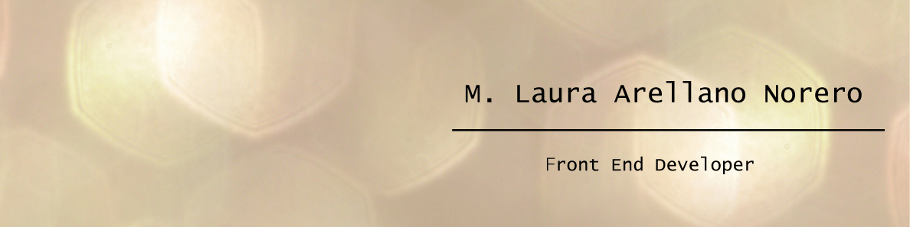

<h1>Hi there 👋 I'm ...</h1>

<h3>About me</h3>

- I'm from Santiago - Chile
- I love transform programming in art
- I love to spend time with my son, my dogs and my work

<h3>Tech Tools Preference</h3>

{
  "image": "https://user-images.githubusercontent.com/624760/91057573-48531300-e61f-11ea-9e13-2d7384e42000.png",
  "issueId": 66,
  "name": "Laura",
  "username": "marellanorero"
}

<h5>Languages</h5>
HTML, Css, Javascript

<h5>Frameworks</h5>
React

<h5>Programing Tools</h5>
Github, Node.js, Insomnia, NPN, VSCode

<h5>CSS & Design Tools</h5>
Bootstrap, Figma, Adobe XD, Photoshop, Illustrator

<h5>Social Network & Payment method</h5>
LinkedIN, Paypal, Mercado Pago

<!--
**marellanorero/marellanorero** is a ✨ _special_ ✨ repository because its `README.md` (this file) appears on your GitHub profile.

Here are some ideas to get you started:

- 🔭 I’m currently working on ...
- 🌱 I’m currently learning ...
- 👯 I’m looking to collaborate on ...
- 🤔 I’m looking for help with ...
- 💬 Ask me about ...
- 📫 How to reach me: ...
- 😄 Pronouns: ...
- ⚡ Fun fact: ...
-->
